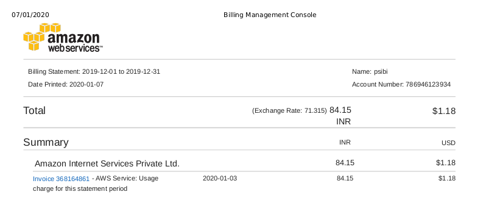

# Motivation
* Wanted to use Rust somewhere!
* Was looking for a project: Heard about this tool when J created a
  ticket for one of our clients
* Summary of the talk: What and How of Credstash

# Credstash
* History
    * AWS launches KMS on 2014
    * Fugue launches credstash tool on 2015
* Credential management and distribution system
* Depends on AWS infrastructure
* Alternatives
    - Vault
    - [cryptic](https://github.com/domodwyer/cryptic)
    - sneaker - Secrets are managed via S3 buckets

# Pricing



Depends primarily on the number of keys you have.

# Usage examples

* Authenticate with AWS
  - Via AWS Keys
  - AWS Profiles
    * rucredstash --profile sibi-admin
  - MFA
    * rucredstash --mfa_serial mfa_arn_id

# Usage examples

Setup DynamoDB table.
``` shellsession
$ rucredstash setup
```
Put secret
``` shellsession
$ rucredstash put "dbpassword" "difficult_password"
```
Get secret
``` shellsession
$ rucredstash get "dbpassword"
```
Delete secret
``` shellsession
$ rucredstash delete "dbpassword"
```

# More examples

``` shellsession
$ rucredstash getall
{
"dbpassword":"difficult_pasword"
}
$ rucredstash list
dbpassword    -- version 000000000000001 --comment
$ rucredstash keys
dbpassword
```

# KMS Concepts

* CMK
* Data Key

# Put Algorithm

``` shellsession
$ credstash put dbpassword difficult_password
```

* Generate 64 bytes Data key.
* Split the key into half.
* Encrypt credential using AES algorithm (CTR mode)
* Compute HMAC of the encrypted text.
* Store them in the dynamo table

# Get Algorithm

``` shellsession
$ credstash get dbpassword
```

* Fetch the corresponding row from DynamoDB.
* Decrypt the encrypted data key using KMS.
    - Split the key into half.
* Verify the HMAC of the encrypted text.
* Decrypt the credential using first half of the key.

# Comparision with credstash

* Doesn't implement putall subcommand (yet)
* Doesn't support following digest methods: MD5, SHA224
* Supports MFA authentication!

# Comparision with Haskell

* rusoto / amazonka
    * Build times
    * Much well maintained
* Async code issues
* Crypto library
* Documentation of libraries

# Future work

* Implement putall subcommand
* Provide cli subcommand to create CMK
* Improve error message when it fails
* Embrace Rust's async/await model

# Questions
